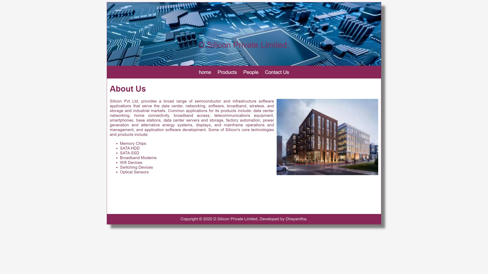
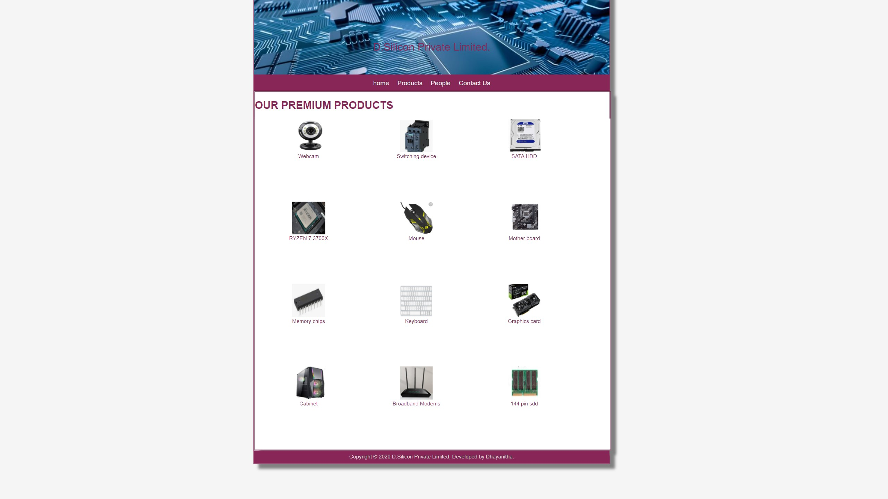
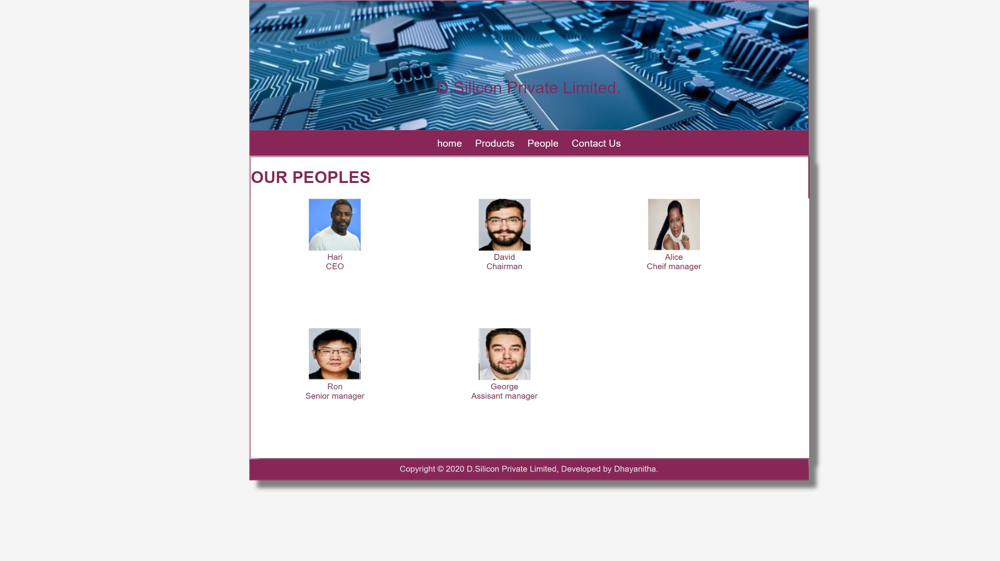
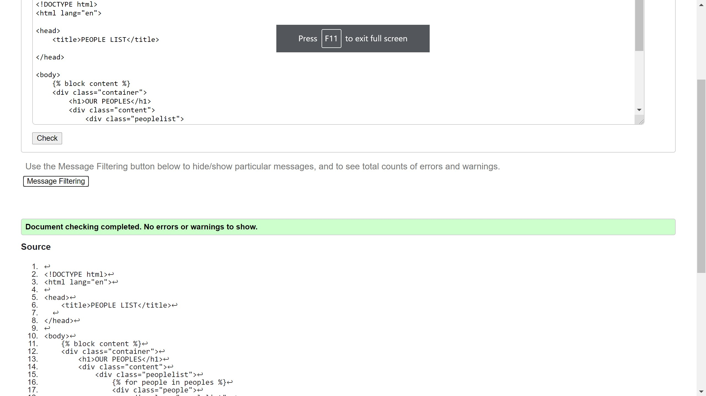
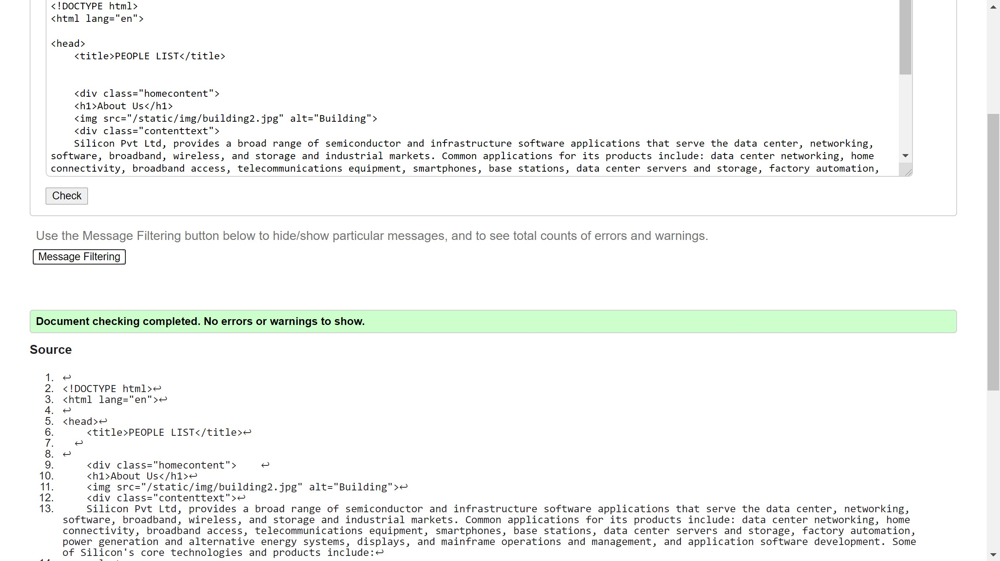
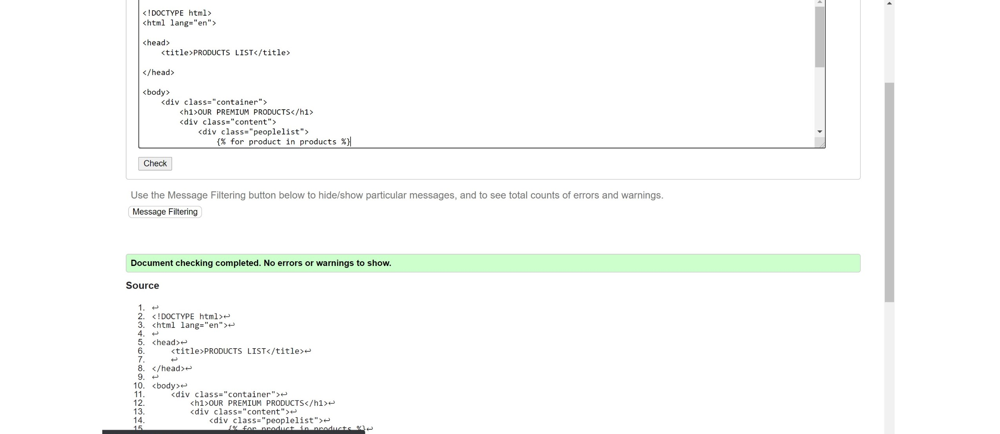
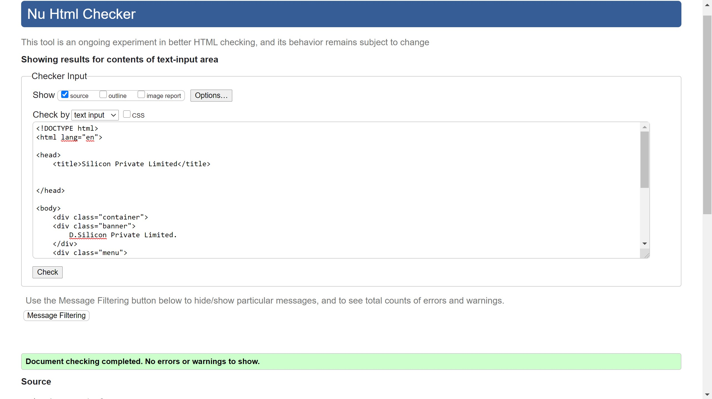

# Dynamic Website Design for a Manufacturing Company
## AIM:
To design a dynamic website for a chip manufacturing company.

## DESIGN STEPS:
### Step 1: 
Requirement collection.
### Step 2:
Creating the layout using HTML and CSS.
### Step 3:
Updating the sample content.
### Step 4:
Choose the appropriate style and color scheme.
### Step 5:
Validate the layout in various browsers.
### Step 6:
Validate the HTML code.
### Step 7:
Create a database model and migrate the database.
### Step 8:
Retrieve data from database and display it in a dynamic webpage.
### Step 9:
Publish the website in the given URL.

## PROGRAM:

### base.html
```

<!DOCTYPE html>
<html lang="en">

<head>
    <title>Silicon Private Limited</title>
    <link rel="stylesheet" href="">
    <link rel = "icon" href ="" type = "image/x-icon"> 
              
</head>

<body>
    <div class="container">
    <div class="banner">
        D.Silicon Private Limited.
    </div>
    <div class="menu">
        <div class="menuitem"><a href="/home">home</a></div> 
        <div class="menuitem"><a href="/products">Products</a></div> 
        <div class="menuitem"><a href="/people">People</a></div>
        <div class="menuitem"><a href="/contact">Contact Us</a></div> 
    </div><div class="content">
        
    
    </div>
    <div class="footer">
        Copyright © 2020 D.Silicon Private Limited, Developed by Dhayanitha.
    </div>
    </div>
</body>

</html>
```

### home.html
```



    <div class="homecontent">    
    <h1>About Us</h1>
    
    <div class="contenttext">
    Silicon Pvt Ltd, provides a broad range of semiconductor and infrastructure software applications that serve the data center, networking, software, broadband, wireless, and storage and industrial markets. Common applications for its products include: data center networking, home connectivity, broadband access, telecommunications equipment, smartphones, base stations, data center servers and storage, factory automation, power generation and alternative energy systems, displays, and mainframe operations and management, and application software development. Some of Silicon's core technologies and products include:
    <ul>
        <li>Memory Chips</li>
        <li>SATA HDD</li>
        <li>SATA SSD </li>
        <li>Broadband Modems</li>
        <li>Wifi Devices</li>
        <li>Switching Devices</li>
        <li>Optical Sensors</li>
    </ul> 
    </div>
    </div>

```
### products.html
```


<!DOCTYPE html>
<html>

<head>
    <title>PRODUCTS LIST</title>
    <link rel="stylesheet" href="">
</head>

<body>
    
    <div class="container">
        <h1>OUR PREMIUM PRODUCTS</h1>
        <div class="content">
            <div class="peoplelist">
                
                <div class="people">
                    <div class="peoplelist">
                        
                    </div>
                    <div class="peoplephoto">{{ photo }}</div>
                    <div class="peoplename">{{ product.name }}</div>
                    <div class="peopledesignation">{{ product.price }}</div>
                </div>
                
            </div>
        </div>
    </div>
    
</body>

</html>
```
### people.html
```


<!DOCTYPE html>
<html>

<head>
    <title>PEOPLE LIST</title>
    <link rel="stylesheet" href="">
</head>

<body>
    
    <div class="container">
        <h1>OUR PEOPLES</h1>
        <div class="content">
            <div class="peoplelist">
                
                <div class="people">
                    <div class="peoplelist">
                        
                    </div>
                    <div class="peoplephoto">{{ photo }}</div>
                    <div class="peoplename">{{ people.name }}</div>
                    <div class="peopledesignation">{{ people.designation }}</div>
                </div>
                
            </div>
        </div>
    </div>
    
</body>
</html>
```


## OUTPUT:







## CODE VALIDATION REPORT:










## RESULT:
Thus a website is designed for the chip manufacturing company and is hosted in the URL http://dhayanitha.student.saveetha.in:8000/. HTML code is validated.